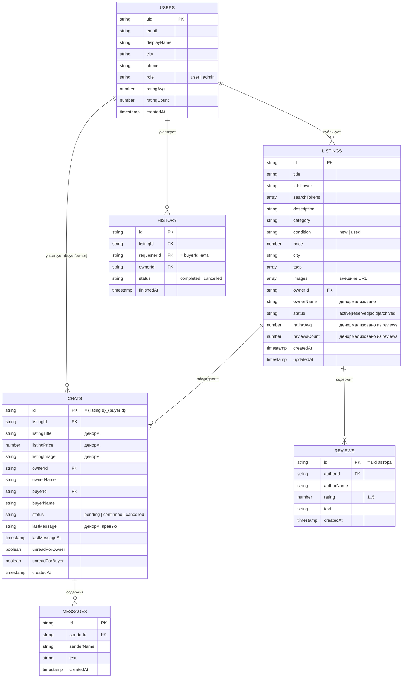

# OTIVA — доска объявлений

Учебный проект: доска объявлений (аналог Avito/OLX) на Firebase Firestore + Firebase Authentication, без бэкенда и без сборщика — чистые HTML/CSS/ES-модули.

## Стек

- **Firebase Authentication** — email/password.
- **Firebase Firestore** — основное хранилище данных, real-time через `onSnapshot`.
- **Firebase Security Rules** — `firestore.rules`.
- **Vanilla JS (ES-модули)**, HTML5, CSS3, Google Fonts (Fraunces + Manrope).
- Firebase SDK подключается модулями прямо с CDN (`gstatic.com`), без npm/бандлера.

## Структура

```
index.html                     редирект на pages/index.html (чтобы открывался корень сайта)
pages/
  index.html            каталог: поиск, фильтры, сортировка, пагинация, realtime-баннер новых объявлений
  listing.html           карточка объявления: realtime-статус, отзывы (realtime CRUD), кнопка «Написать продавцу», похожие
  listing-form.html       публикация / редактирование своего объявления
  messages.html            чаты: список переписок + окно диалога, подтверждение/отклонение сделки
  profile.html              личный кабинет: профиль, мои объявления (realtime), избранное, история сделок, мои отзывы
  admin.html                 админ-панель: объявления, пользователи, сделки (чаты), отзывы, статистика
  auth.html                   вход / регистрация / восстановление пароля
css/                          дизайн-система (styles.css) + стили отдельных страниц — общие для всех pages/*.html
js/                            вся логика (ES-модули), firebase-config.js — точка входа Firebase
```

Все ссылки на css/js внутри `pages/*.html` — относительные (`../css/...`, `../js/...`); переходы между страницами (`href="listing.html?id=..."` и т.п.) — просто по имени файла, так как все они лежат рядом друг с другом внутри `pages/`.

## Схема данных Firestore



`REVIEWS` — подколлекция `listings/{listingId}/reviews/{reviewId}`, id документа = `uid` автора (гарантирует не более одного отзыва на пользователя на уровне базы, а не только в UI), плюс `collectionGroup('reviews')` для агрегированного запроса «мои отзывы» в профиле и для модерации в админке.

Избранное — подколлекция `users/{uid}/favorites/{listingId}` (id документа = id объявления, идемпотентно). Поля денормализованы (`listingTitle`, `listingPrice`, `listingImage`, `listingStatus`, `city`) по тому же принципу, что и `chats`/`history` — вкладка «Избранное» в профиле читает только эту подколлекцию, без N дополнительных чтений `listings`. Полностью приватна: правила разрешают доступ только самому пользователю.

### Чат вместо системы броней

Взаимодействие «покупатель ↔ продавец» устроено как переписка, а не разовая заявка: кнопка «Написать продавцу» на карточке объявления открывает (или создаёт) чат `chats/{listingId}_{buyerId}` — один тред на пару «объявление + покупатель», как на Avito. Внутри чата — обычная переписка (`chats/{id}/messages`, realtime) и статус сделки (`pending`), который видит только владелец объявления: он жмёт **«Подтвердить»** (объявление помечается проданным, `status → sold`) или **«Отклонить»**. Оба решения атомарно (`writeBatch`) пишут запись в `history` — это и есть «История действий» из ТЗ, с полным дублированием полей ради производительности (чтение истории не требует join'а с `listings`/`users`). Сам чат при этом не удаляется — переписка остаётся доступной участникам даже после решения по сделке.

## Где используется каждое обязательное Firebase-требование

| Требование | Где реализовано |
|---|---|
| `onSnapshot` (real-time) | каталог — новые объявления ([js/catalog.js](js/catalog.js)); карточка объявления, её отзывы ([js/listing.js](js/listing.js)); список чатов и открытый диалог ([js/messages.js](js/messages.js)); бейдж непрочитанных в хедере ([js/chat.js](js/chat.js)); мои объявления ([js/profile.js](js/profile.js)) |
| Пагинация | каталог: `limit(15)` + `startAfter` + «Показать ещё» ([js/catalog.js](js/catalog.js)); похожие объявления на детальной странице ([js/listing.js](js/listing.js)) |
| Поиск через запросы Firestore | `titleLower`/`searchTokens` + `array-contains-any`, без сторонних сервисов ([js/catalog.js](js/catalog.js)) |
| Оптимизация запросов | денормализация (`ownerName`, `listingTitle/Price/Image` и т.д. — не тянем связанные документы при рендере списков); агрегатные запросы `getCountFromServer`/`getAggregateFromServer` для статистики в админке вместо чтения всех документов ([js/admin.js](js/admin.js)) |
| Индексы | [firestore.indexes.json](firestore.indexes.json) — под все комбинации фильтр+сортировка каталога, а также запросы «мои объявления/чаты/история/отзывы» |
| Security Rules | [firestore.rules](firestore.rules) — разграничение `user`/`admin`, доступ к чату только у его участников, неизменяемый лог `history`, id отзыва/чата закреплён за автором на уровне правил |

## Известные ограничения (осознанные упрощения)

- Firestore не поддерживает полнотекстовый поиск по подстроке — поиск работает по токенам заголовка/описания (`array-contains-any`, до 10 токенов за запрос). Для продакшена обычно подключают Algolia/Typesense, но по условиям задания достаточно «через запросы Firestore».
- Firestore разрешает только одно поле с диапазонным условием (`>=`/`<=`) на запрос, и `orderBy` должно начинаться с этого поля — поэтому при заданном диапазоне цены сортировка каталога автоматически переключается на «по цене» (см. `buildQuery` в [js/catalog.js](js/catalog.js)).
- Без Cloud Functions / Admin SDK нельзя удалить сам аккаунт `Firebase Auth` с клиента — из админ-панели можно менять роль и удалять Firestore-профиль/контент пользователя, но не сам логин/пароль.
- Изображения — только по внешней ссылке (Firebase Storage не входит в требуемый стек).
