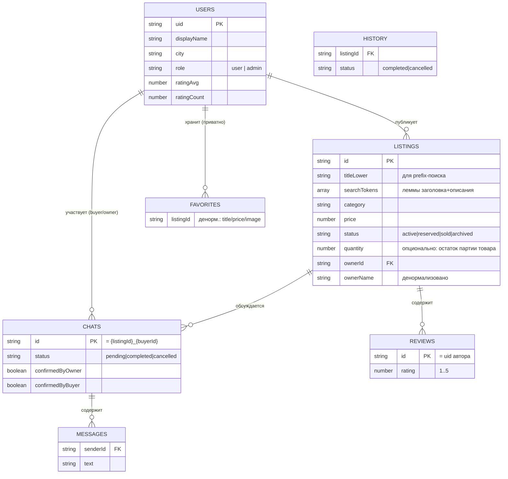

# OTIVA — доска объявлений

Доска объявлений для казахстанского рынка (аналог Avito/OLX): каталог, карточка объявления, чат покупателя с продавцом со сделкой внутри, личный кабинет и админ-панель. Полностью на **Firebase** (Firestore + Authentication) — без своего бэкенда, без сборщика, без npm. HTML/CSS/ES-модули напрямую в браузере.

Живой пример того, что можно построить на одном Firestore + Security Rules, если сознательно проектировать схему данных под конкретные запросы, а не «просто сохранять объекты».

## Стек

- **Firebase Authentication** — email/password.
- **Firebase Firestore** — единственное хранилище данных, realtime через `onSnapshot`, офлайн-кэш через `persistentLocalCache`.
- **Firebase Security Rules** — вся авторизация на уровне базы, а не только в клиентском коде.
- **Vanilla JS (ES-модули)**, без React/Vue/сборщика. SDK подключается прямо с `gstatic.com` через `<script type="module">`.
- Чистый CSS: дизайн-токены на custom properties, тёмная тема, mobile-first.

## Структура проекта

```
index.html                редирект на pages/index.html
pages/
  index.html               каталог: поиск, фильтры, сортировка, пагинация, live-баннер новых объявлений
  listing.html              карточка объявления, отзывы, похожие объявления
  listing-form.html          публикация / редактирование своего объявления
  messages.html               чаты: список + окно диалога, сделка внутри переписки
  profile.html                 профиль, мои объявления, избранное, история сделок, мои отзывы
  admin.html                    объявления, пользователи, сделки, отзывы, статистика
  auth.html                      вход / регистрация / восстановление пароля
css/                       styles.css — дизайн-система; остальные файлы — стили конкретных страниц
js/
  firebase-config.js        инициализация Firebase, единственное место с ключами проекта
  constants.js                категории, города, статусы, размеры страниц
  utils.js                     форматирование, toast-уведомления, общая разметка карточки объявления
  auth.js                       состояние авторизации, guard-функции страниц, рендер шапки
  modal.js                       кастомные модалки (замена window.confirm + двухшаговые сценарии)
  chat.js, favorites.js, theme.js   отдельные независимые модули на одну ответственность каждый
  catalog.js, listing.js, listing-form.js, messages.js, profile.js, admin.js   логика конкретных страниц
firestore.rules            security rules
firestore.indexes.json     составные индексы под все запросы каталога и профиля
```

Каждая страница в `pages/` — самостоятельная точка входа: свой `<script type="module" src="../js/....js">`, ничего общего не импортируется неявно. Общий код (шапка, авторизация, модалки, форматирование) — обычные ES-модули, импортируемые explicitly там, где нужны.

## Быстрый старт

1. Создать проект в [Firebase Console](https://console.firebase.google.com), включить **Authentication → Email/Password** и **Firestore Database**.
2. Вставить конфиг веб-приложения в `js/firebase-config.js` (объект `firebaseConfig`).
3. Задеплоить правила и индексы:
   ```bash
   npx firebase-tools deploy --only firestore:rules,firestore:indexes
   ```
4. Поднять любой статический сервер из корня проекта (ES-модули требуют http-origin, `file://` не подходит):
   ```bash
   python3 -m http.server 8000
   ```
5. Открыть `http://localhost:8000/pages/index.html`.

## Схема данных


```mermaid
erDiagram
    USERS ||--o{ LISTINGS : "публикует"
    USERS ||--o{ CHATS : "участвует (buyer/owner)"
    LISTINGS ||--o{ REVIEWS : "содержит"
    LISTINGS ||--o{ CHATS : "обсуждается"
    CHATS ||--o{ MESSAGES : "содержит"
    USERS ||--o{ FAVORITES : "хранит (приватно)"

    USERS {
      string uid PK
      string displayName
      string city
      string role "user | admin"
      number ratingAvg
      number ratingCount
    }
    LISTINGS {
      string id PK
      string titleLower "для prefix-поиска"
      array  searchTokens "леммы заголовка+описания"
      string category
      number price
      string status "active|reserved|sold|archived"
      number quantity "опционально: остаток партии товара"
      string ownerId FK
      string ownerName "денормализовано"
    }
    REVIEWS {
      string id PK "= uid автора"
      number rating "1..5"
    }
    CHATS {
      string id PK "= {listingId}_{buyerId}"
      string status "pending|completed|cancelled"
      boolean confirmedByOwner
      boolean confirmedByBuyer
    }
    MESSAGES {
      string senderId FK
      string text
    }
    HISTORY {
      string listingId FK
      string status "completed|cancelled"
    }
    FAVORITES {
      string listingId "денорм.: title/price/image"
    }
```

Ниже — не всё, что в схеме есть, а те решения, которые не были бы очевидны из одних только названий полей.

## Что здесь есть и как это работает

### 1. Каталог: составной запрос вместо стороннего поискового движка

Firestore не умеет полнотекстовый поиск по подстроке. Вместо подключения Algolia/Typesense — токенизация на клиенте при сохранении объявления (`tokenize()` в `js/utils.js`) и `array-contains-any` по этим токенам при чтении:

```js
// js/catalog.js — buildQuery()
const tokens = filters.search ? tokenize(filters.search).slice(0, 10) : [];

if (tokens.length) {
  clauses.push(where('searchTokens', 'array-contains-any', tokens));
  orderClauses = [orderBy('createdAt', 'desc')];
} else if (filters.priceMin != null || filters.priceMax != null) {
  // Firestore разрешает только одно поле с диапазонным условием (>=/<=) на запрос,
  // и orderBy обязан начинаться с этого же поля — поэтому при заданном диапазоне
  // цены сортировка каталога переключается на «по цене», даже если выбрана другая.
  if (filters.priceMin != null) clauses.push(where('price', '>=', filters.priceMin));
  if (filters.priceMax != null) clauses.push(where('price', '<=', filters.priceMax));
  orderClauses = [orderBy('price', filters.sort === 'price_desc' ? 'desc' : 'asc')];
} else {
  orderClauses = [orderBy(sortDef.field, sortDef.dir)];
}
```

Пагинация — курсорная (`startAfter(lastDoc).limit(15)`), а не `offset`: у Firestore нет `offset`, и курсор к тому же не «съезжает», если во время листания кто-то добавил новое объявление выше по сортировке.

Отдельно — realtime-баннер «Появились новые объявления»: лёгкий `onSnapshot` только по последнему документу (`limit(1)`), без полной пересборки списка при каждом чужом действии:

```js
const liveQuery = query(collection(db, 'listings'), where('status', '==', 'active'), orderBy('createdAt', 'desc'), limit(1));
onSnapshot(liveQuery, (snap) => {
  const topId = snap.docs[0]?.id;
  if (topId !== initialLiveId && !loadedDocs.some((d) => d.id === topId)) liveBanner.hidden = false;
});
```

### 2. Сделка внутри переписки: двустороннее подтверждение и автозавершение

Вместо отдельной сущности «бронь» — обычный чат `chats/{listingId}_{buyerId}` (детерминированный id — повторный клик «Написать продавцу» просто открывает существующий тред, а не плодит дубликаты) со встроенным статусом сделки. Каждая сторона подтверждает **только свой флаг**:

```js
// js/messages.js — confirmMySide()
const myField = isOwnerRole ? 'confirmedByOwner' : 'confirmedByBuyer';
await updateDoc(doc(db, 'chats', activeChatId), { [myField]: true });
if (otherConfirmed) tryAutoFinalize(activeChatId, { ...chat, [myField]: true });
```

Как только оба флага `true`, сделка **сама** переходит в `completed` — отдельной кнопки «Завершить» нет. Завершает её всегда клиент владельца (см. `firestore.rules` ниже — покупателю такое право не выдано), поэтому если последним подтвердил покупатель, `onSnapshot` у владельца сам вызовет `tryAutoFinalize` при следующем изменении документа:

```js
onSnapshot(q, (snap) => {
  // ...
  chatsCache.forEach((c, id) => tryAutoFinalize(id, c));
});
```

`tryAutoFinalize` атомарно (`writeBatch`) переводит чат в `completed`, пишет запись в `history` и обновляет остаток товара:

```js
const listingSnap = await getDoc(listingRef);
const hasQty = typeof listingSnap.data().quantity === 'number';
const remainingQty = Math.max(0, (hasQty ? listingSnap.data().quantity : 1) - 1);
const soldOut = remainingQty <= 0;

const batch = writeBatch(db);
batch.update(doc(db, 'chats', chatId), { status: 'completed' });
batch.set(doc(collection(db, 'history')), { /* денормализованная запись сделки */ });
batch.update(listingRef, { ...(hasQty && { quantity: remainingQty }), ...(soldOut && { status: 'sold' }) });
await batch.commit();
```

Объявления без штучного учёта (услуги, недвижимость, транспорт) ведут себя так, как будто у них `quantity: 1` — каждая сделка сразу продаёт «всё». Если товара ещё много, объявление тихо остаётся активным с уменьшенным остатком и никто ничего не видит; если раскуплено подчистую — статус меняется на `sold`, и продавцу тут же предлагается модалка **«Оставить активным?»**, где он может сразу вписать реальный остаток, не уходя в форму редактирования (`js/modal.js → finalizeSaleModal`).

Отклонить сделку можно с любой стороны, но только пока не подтвердили обе — это ограничение продублировано в `firestore.rules`, а не только в UI:

```js
allow update: if isSignedIn() && (
  (isChatParticipant(resource) &&
    !(resource.data.confirmedByOwner == true && resource.data.confirmedByBuyer == true) &&
    request.resource.data.diff(resource.data).affectedKeys().hasOnly(['status']) &&
    request.resource.data.status == 'cancelled')
  || /* ...остальные ветки: подтверждение своего флага, завершение владельцем, превью сообщения */
);
```

### 3. Кастомные модалки вместо `window.confirm` / `window.prompt`

`js/modal.js` — два экспорта, оба возвращают `Promise`, оба рисуются в один и тот же `#modal-host`:

- `confirmModal({ title, message, confirmText, danger })` — простая замена `confirm()`, `resolve(true|false)`.
- `finalizeSaleModal({ listingTitle, hasQty })` — двухшаговый сценарий: выбор действия → (если объявление со штучным учётом) поле ввода нового остатка внутри той же модалки, без перехода на другую страницу. Возвращает `null` / `true` / `{ quantity }` — три разных исхода одним промисом, вызывающий код (`messages.js`) просто ветвится по типу результата.

### 4. Избранное: Firestore-подколлекция с клиентским кэшем, не localStorage

`users/{uid}/favorites/{listingId}` — id документа равен id объявления, поэтому «добавить в избранное» идемпотентно (`setDoc`, не нужно сначала проверять, есть ли уже). Поля денормализованы (`listingTitle`, `listingPrice`, `listingImage`), чтобы вкладка «Избранное» в профиле не делала N чтений `listings` — только один `getDocs` по подколлекции:

```js
// js/favorites.js
export async function toggleFavorite(listingId, listing = {}) {
  const ref = doc(db, 'users', user.uid, 'favorites', listingId);
  if (cache.has(listingId)) { await deleteDoc(ref); cache.delete(listingId); return false; }
  const data = { listingId, listingTitle: listing.title, listingPrice: listing.price, listingImage: listing.images?.[0], createdAt: serverTimestamp() };
  await setDoc(ref, data);
  cache.set(listingId, data);
  return true;
}
```

Модуль сам следит за тем, чтобы весь список загружался максимум один раз за сессию (`ensureFavoritesLoaded()` мемоизирует промис), а не при каждом рендере карточки.

### 5. Один отзыв на человека — гарантия на уровне базы, не только в UI

Id документа отзыва равен `uid` автора:

```js
await setDoc(doc(db, 'listings', listingId, 'reviews', user.uid), { authorId: user.uid, rating, text, createdAt: ... });
```

Второй отзыв от того же пользователя физически перезаписывает первый документ — оставить два отзыва невозможно, даже если обойти клиентский код. Это же условие продублировано в `firestore.rules`:

```js
match /reviews/{reviewId} {
  allow create: if isSignedIn() && reviewId == request.auth.uid && request.resource.data.authorId == request.auth.uid;
}
```

Отдельная деталь: вложенное правило `listings/{id}/reviews/{reviewId}` покрывает обычные чтения (по конкретному объявлению), но `collectionGroup('reviews')` — которым пользуются «Мои отзывы» в профиле и модерация в админке — это отдельный тип запроса, и Firestore требует под него отдельное top-level правило с wildcard-путём:

```js
match /{path=**}/reviews/{reviewId} {
  allow read: if true;
}
```

Без этой ветки `collectionGroup`-запрос целиком отклонялся бы как `permission-denied`, даже когда вложенное правило разрешает чтение.

### 6. Admin-панель: агрегатные запросы вместо чтения всей коллекции

Статистика в `admin.html` не читает документы, чтобы их посчитать — использует серверную агрегацию:

```js
// js/admin.js — loadStats()
const [listingsCount, activeCount, usersCount] = await Promise.all([
  getCountFromServer(collection(db, 'listings')),
  getCountFromServer(query(collection(db, 'listings'), where('status', '==', 'active'))),
  getCountFromServer(collection(db, 'users')),
]);
const agg = await getAggregateFromServer(
  query(collection(db, 'listings'), where('status', '==', 'active')),
  { avgPrice: average('price'), totalValue: sum('price') }
);
```

Это один короткий сетевой запрос на каждую цифру, а не выгрузка тысяч документов с последующим `.length`/`.reduce()` в браузере.

Второе: администратору можно посмотреть переписку любых двух пользователей (без права писать в неё) — реализовано отдельной read-only `onSnapshot`-подпиской, открывающейся поверх таблицы сделок, и отдельной веткой `isAdmin()` в правилах для `chats`/`messages`. Права записи туда у админа по-прежнему нет — `admin.js` только читает.

### 7. Тема оформления: одна CSS-переменная решает всё

Светлая/тёмная/системная тема — не три набора стилей, а один набор custom properties, переопределяемый в трёх местах: по умолчанию (`:root`), по системной настройке (`@media (prefers-color-scheme: dark)`), и принудительно (`:root[data-theme="dark"]`). Компоненты во всём CSS ссылаются только на переменные (`var(--surface)`, `var(--border)`), поэтому переключение темы — это буквально одна строка кода:

```js
// js/theme.js
function applyTheme(value) {
  const root = document.documentElement;
  if (value === 'light' || value === 'dark') root.setAttribute('data-theme', value);
  else root.removeAttribute('data-theme'); // 'system' — отдать решение медиа-запросу
}
```

Выбор сохраняется в `localStorage` и применяется инлайн-скриптом в `<head>` **до** загрузки основного CSS — иначе при перезагрузке страницы в тёмной теме был бы видимый мигающий переход со светлой на тёмную.

### 8. Realtime + офлайн-кэш в multi-page приложении

Это MPA: каждый переход между страницами — полная перезагрузка и новая инициализация Firestore с нуля. Без кэша это означало бы, что даже повторное открытие уже просмотренного объявления снова ждёт сеть. Firestore настроен с `persistentLocalCache` — офлайн-хранилищем в IndexedDB:

```js
// js/firebase-config.js
export const db = initializeFirestore(app, {
  localCache: persistentLocalCache({ tabManager: persistentMultipleTabManager() }),
});
```

SDK сначала мгновенно отдаёт то, что уже есть на диске, и досинхронизирует свежие данные в фоне через тот же `onSnapshot` — realtime не отключается, просто первый кадр страницы не пустой. `persistentMultipleTabManager` нужен, чтобы кэш не ломался при открытии сайта в нескольких вкладках одновременно.

### 9. Индексы под реальные комбинации фильтров

`firestore.indexes.json` — не сгенерирован вслепую, а построен под конкретные комбинации `where`/`orderBy`, которые реально складывает `buildQuery()` в каталоге (статус × категория × дата, статус × город × цена, статус × поиск по токенам × дата и т.д.), плюс отдельные индексы под `collectionGroup('reviews')` и коллекции `chats`/`history`, которые профиль и админка читают по `ownerId`/`buyerId`/`requesterId`.

## Известные ограничения

- Поиск — по токенам заголовка/описания (`array-contains-any`, до 10 токенов за раз), не полнотекстовый и не с опечатками. Для продакшена — Algolia/Typesense; здесь сознательный выбор «решить средствами самого Firestore».
- Диапазон цены и сортировка по другому полю одновременно не работают — ограничение самого Firestore (одно поле с `>=`/`<=` на запрос), не баг: при активном диапазоне цены каталог сам переключает сортировку на «по цене».
- Без Cloud Functions/Admin SDK нельзя удалить сам аккаунт Firebase Auth с клиента — админ управляет ролью и данными в Firestore, но не логином/паролем пользователя.
- Изображения — только по внешней ссылке; Firebase Storage не входит в стек.
